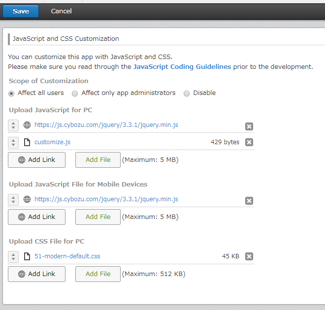

# kintone-customize-uploader

[](https://badge.fury.io/js/%40kintone%2Fcustomize-uploader)

A kintone customize uploader

## Usage
```
% npm install @kintone/customize-uploader

% ./node_modules/.bin/kintone-customize-uploader init
? Input your app id: {appId}
? Select the scope of customization: "ALL" | "ADMIN" | "NONE"

dest/customize-manifest.json file has been created

% ./node_modules/.bin/kintone-customize-uploader import dest/customize-manifest.json
? Input your kintone's domain (example.cybozu.com): {yourDomain}
? Input your username: {userLoginName}
? Input your password: [input is hidden] {yourPassword}

Generate customize-manifest.json from kintone app customize
Download Uploaded files on kintone app customize
Finish importing from kintone app customize

% ./node_modules/.bin/kintone-customize-uploader dest/customize-manifest.json
```

or

```
% npm install -g @kintone/customize-uploader

% kintone-customize-uploader init
? Input your app id: {appId}
? Select the scope of customization: "ALL" | "ADMIN" | "NONE"

dest/customize-manifest.json file has been created

% kintone-customize-uploader import dest/customize-manifest.json
? Input your kintone's domain (example.cybozu.com): {yourDomain}
? Input your username: {userLoginName}
? Input your password: [input is hidden] {yourPassword}

Generate customize-manifest.json from kintone app customize
Download Uploaded files on kintone app customize
Finish importing from kintone app customize

% kintone-customize-uploader dest/customize-manifest.json
```

If you want to upload the customize files automatically when a file is updated, you can use `--watch` option.

```
% kintone-customize-uploader --watch dest/customize-manifest.json
```

## Options
```
  Usage
    $ kintone-customize-uploader <manifestFile>
  Options
    --base-url Base-url of your kintone
    --domain Domain of your kintone (If you set --base-url, this value is not necessary.)
    --username Login username
    --password User's password
    --basic-auth-username Basic Authentication username
    --basic-auth-password Basic Authentication password
    --proxy Proxy server
    --watch Watch the changes of customize files and re-run
    --dest-dir -d option for subcommands
                  this option stands for output directory
                  default value is dest/
    --lang Using language (en or ja)
    --guest-space-id Guest space ID for uploading files

  SubCommands
    init   generate customize-manifest.json

    import download js/css files and update customize-manifest.json

    You can set the values through environment variables
    base-url: KINTONE_BASE_URL
    domain: KINTONE_DOMAIN
    username: KINTONE_USERNAME
    password: KINTONE_PASSWORD
    basic-auth-username: KINTONE_BASIC_AUTH_USERNAME
    basic-auth-password: KINTONE_BASIC_AUTH_PASSWORD
    proxy: HTTPS_PROXY or HTTP_PROXY
```

If you omit the options, you can input the options interactively.
```
% kintone-customize-uploader dest/customize-manifest.json
? Input your domain: example.cybozu.com
? Input your username: sato
? Input your password: [hidden]
```

## Example
This is an example of `customize-manifest.json` .
```json
{
    "app": "1",
    "scope": "ALL",
    "desktop": {
        "js": [
            "https://js.cybozu.com/jquery/3.3.1/jquery.min.js",
            "sample/customize.js"
        ],
        "css": [
            "sample/51-modern-default.css"
        ]
    },
    "mobile": {
        "js": [
            "https://js.cybozu.com/jquery/3.3.1/jquery.min.js"
        ]
    }
}
```
- `app` : The app id where to upload customize files to (`"APP_ID"`)
- `scope`: The scope to apply your customization (`"ALL"` || `"ADMIN"` || `"NONE"`)
- `desktop`: The customize files applied in PC view  (`"js": []` || `"css": []`)
- `mobile`: The customize files applied in mobile view (`"js": []`)

To upload files, run `kintone-customize-uploader <manifestFile>`.
```
% kintone-customize-uploader dest/customize-manifest.json
? Input your domain: example.cybozu.com
? Input your username: sato
? Input your password: [hidden]

sample/customize.js has been uploaded!
sample/51-modern-default.css has been uploaded!
JavaScript/CSS files have been uploaded!
Customize setting has been updated!
Wait for deploying completed...
Wait for deploying completed...
Wait for deploying completed...
Setting has been deployed!
```

In this example, JavaScript and CSS Customization is set as below.


## LICENSE
MIT License
