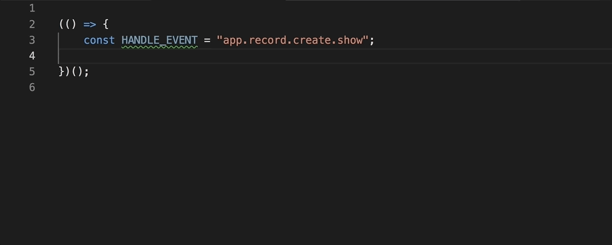
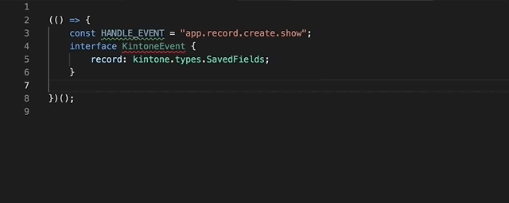

# dts-gen

Type definition for kintone customize and
Type definition generation tool from kintone form settings.


## Write kintone customize with TypeScript

In kintone JavaScript customize, there are functions which are defined in kintone.
When a user tries to write JavaScript customize, there are no definitions on typescript compile context.

So This tools has `kintone.d.ts` files which has a global function definition in TypeScript syntax manner. And then, you can write JavaScript customize with TypeScript.

And This tools also contains a command-line tool for type definition generator which
uses kintone form settings API.

## How to generate kintone-dts-gen

you can generate `sample-field.d.ts` like below:

```bash
$ kintone-dts-gen --base-url https://***.cybozu.com \
                 -u username \
                 -p password \
                 --app-id 12 \
                 --type-name SampleFields \
                 --namespace company.name.types \
                 -o sample-fields.d.ts
```

You can also use [API token authentication](https://developer.kintone.io/hc/en-us/articles/212495188#APItokenAuth) and [OAuth authentication](https://developer.kintone.io/hc/en-us/articles/360001562353-How-to-add-OAuth-clients) instead of the password authentication.

You have to grant `dts-gen` the `k:app_settings:read` scope to use OAuth authentication.

```bash
// API token
$ kintone-dts-gen --base-url https://***.cybozu.com \
                 --api-token YourApiToken
                 --app-id 12 \
                 --type-name SampleFields \
                 --namespace company.name.types \
                 -o sample-fields.d.ts
// OAuth token
$ kintone-dts-gen --base-url https://***.cybozu.com \
                 --oauth-token YourOAuthToken
                 --app-id 12 \
                 --type-name SampleFields \
                 --namespace company.name.types \
                 -o sample-fields.d.ts
```


You can set the values through environment variables.

```
base-url: KINTONE_BASE_URL
username: KINTONE_USERNAME
password: KINTONE_PASSWORD
apiToken: KINTONE_API_TOKEN
oAuthToken: KINTONE_OAUTH_TOKEN
basic-auth-username: KINTONE_BASIC_AUTH_USERNAME
basic-auth-password: KINTONE_BASIC_AUTH_PASSWORD
```

kintone-dts-gen generates record field definition from kintone form settings.
And from this command line option, record field type definition(`company.name.types.SampleFields`)
is defined in `sample-fields.d.ts`.

**If you change form settings in kintone, Please re-generate type definition files**

### demo mode
If you won't have a kintone, you can try with demo mode.
you can generate demo type definition like below:

```bash
$ kintone-dts-gen --demo
```

kintone-dts-gen generates demo record field definition from demo data.
record field type definition(`kintone.types.Fields`)  is defined in `fields.d.ts`

### command line options
You can confirm command line options with `kintone-dts-gen --help`

### Write kintone JavaScript customize with TypeScript

1. Create `tsconfig.json` in project root

```bash
npx tsc --init
```

```javascript
{
  "compilerOptions": {
  /** generated by tsc --init */
  },
  /**
   * Include type definition files
   * 1. kintone.d.ts
   * 2. file which was generated by dts-gen
   **/
  "files" : [
    "./node_modules/@kintone/dts-gen/kintone.d.ts",
    // If you generated field definition like: "./src/demo-fields.d.ts"
  ],
  "include": [
    "src/**/*"
  ],
  "exclude": [
    "dist",
  ]
}
```

2. Compile With TypeScript

Write Typescript code

```typescript
interface Event {
    appId: number;
    recordId: number;
    record: kintone.types.SavedDemoFields;
}

(() => {
    kintone.events.on("app.record.create.show", (event: Event) => {
        const appId = event.appId;
        const recordId = event.recordId;
        const type = event.record.Record_number.value;
    });
})();
```

And then, You can compile with `tsc` command!
Welcome to TypeSafe kintone coding world!

### Appearance of code completion

Define Interface:



Call `kintone.events.on`:



Compile Error:


Code completion in Subtable field: 


### Write kintone JavaScript customize with JavaScript

If there are some reasons why you can't use TypeScript, you can use the Type Definition as a type in jsdoc.
If you work with VSCode, WebStorm IDE or some editor, you can gain the power of code completion!

1. Write triple slash comment in your kintone customize file
```javascript
/// <reference path="../node_modules/@kintone/dts-gen/kintone.d.ts" />
/// <reference path="./demo-field.d.ts" />
(function() {
    kintone.events.on("test", function(event){
        /**
         * @type {kintone.types.DemoField}
         */
        const record = event.record;
    });
})();
```
