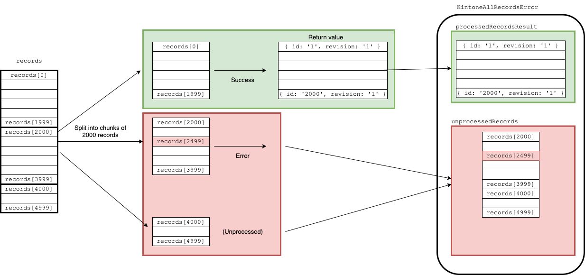

# Error Handling

- [KintoneRestAPIError](#kintonerestapierror)
- [KintoneAllRecordsError](#kintoneallrecordserror)
- [KintoneAbortSearchError](#kintoneabortsearcherror)


These errors are exported so that it is available to import and use them like the following.

```javascript
import {
  KintoneRestAPIError,
  KintoneAllRecordsError,
  KintoneAbortSearchError
} from "@kintone/rest-api-client";
```
## KintoneRestAPIError

When the API request responds with a status code other than 200, the client raises [`KintoneRestAPIError`](../src/KintoneRestAPIError.ts).

[`KintoneRestAPIError`](../src/KintoneRestAPIError.ts) has the following properties:

| Name             |         Type          | Description                                                                                                                                                |
| ---------------- | :-------------------: | ---------------------------------------------------------------------------------------------------------------------------------------------------------- |
| id               |        String         | The ID of the error.                                                                                                                                       |
| code             |        String         | The code of the error, to specify the type of error it is.                                                                                                 |
| status           |        Number         | The HTTP status of the response.                                                                                                                           |
| headers          |        Object         | The HTTP headers of the response.                                                                                                                          |
| message          |        String         | The error message.                                                                                                                                         |
| bulkRequestIndex | Number or `undefined` | The index of the failed request when executing [bulkRequest](docs/bulkRequest.md) and one of the requests fails.<br />This value is `undefined` otherwise. |

## KintoneAllRecordsError

The following methods could throw `KintoneAllRecordsError`.

- [addAllRecords](record.md#addAllRecords)
- [updateAllRecords](record.md#updateAllRecords)
- [deleteAllRecords](record.md#deleteAllRecords)

`KintoneAllRecordsError` has the following properties.

| Name                   |                    Type                     | Description                                                                                                                                 |
| ---------------------- | :-----------------------------------------: | ------------------------------------------------------------------------------------------------------------------------------------------- |
| processedRecordsResult |                   Object                    | The result of the records that have been processed successfully. This is the same type specified in the **Returns** section of each method. |
| unprocessedRecords     |                    Array                    | The records that have not been processed. This is a part of `records` passed as an argument.                                                |
| error                  | [KintoneRestAPIError](#KintoneRestAPIError) | The instance of `KintoneRestAPIError`                                                                                                       |
| errorIndex             |         Number or<br />`undefined`          | The index that an error ocurred.                                                                                                            |

### Example of KintoneAllRecordsError

Suppose we want to add 5000 records by using [addAllRecords](record.md#addAllRecords),  
and there's an invalid parameter at 2500th record (`records[2499]`) that raised an error.

In this case, rest-api-client split the `records` into 3 chunks of records, and the result of each chunk is the following:

1. `records[0] - records[1999]` (2000 records) ... Success. All records are added to Kintone.
2. `records[2000] - records[3999]` (2000 records) ... Fail. All records are **not** added to Kintone.
3. `records[4000] - records[4999]` (1000 records) ... Unprocessed. All records are **not** added to Kintone.



Then the properties of `KintoneAllRecordsError` is:

| Name                   | Content                                    |
| ---------------------- | ------------------------------------------ |
| processedRecordsResult | `{ records: results[0] - results[1999] }`  |
| unprocessedRecords     | `records[2000] - records[4999]`            |
| error                  | An instance of `KintoneRestAPIError`       |
| errorIndex             | `2499` (If Kintone returns) or `undefined` |

## KintoneAbortSearchError

This error occurs when the [`enableAbortSearchError`](../README.md#parameters-for-kintonerestapiclient) option is enabled, and `KintoneRestAPIClient` receives the message, "Filter aborted because of too many search results," as a value of `x-cybozu-warning` response header.

Kintone returns the warning message when a search condition matches over 100,000 records.

| Name    |  Type  | Description       |
| ------- | :----: | ----------------- |
| message | String | The error message |
